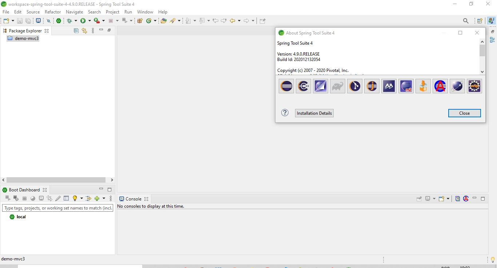

<h1>FERRAMENTAS DE DESENVOLVIEMNTO INSTALADAS</H1>
<h2>Sistema Operacional</h2>

Windows 10 Home

<h2>Spring Tool Suite</h2>
<h3>Definição</h3>

IDE (Integrated Development Environment) - Um ambiente de desenvolvimento integrado, usado para trabalhar com recursos da tecnologia Java e do framework Spring Boot com mais eficiência e produtividade.

<h3>Versão instalada</h3>

4.9.0

<h3>Instalação</h3>

A IDE é uma versão melhorada do Eclipse, portanto pode ser obtida pelos próprios recursos do Eclipse, mas pode também pode ser instalada individualmente, dessa forma:

<ul>
    <li>Indo para o site oficial: <a href='https://spring.io/tools'>Site oficial do Spring</a></li>
    <li>Fazendo o download do instalador.</li>
    <li>Executando o instalador.</li>
    <li>Seguindo o Wizard de instalação.</li>
    <li>Verificando se foi instalado com sucesso.</li>
    <li>A aparência da IDE será próxima disso: 
     
    </li>

</ul>
<h2>Java</h2>
<h3>Definição</h3>

Java é uma linguagem de programação que segue o paradigma orientado a objetos, e atualmente é uma das mais utilizadas no Desenvolvimento Web da parte Back-End, concorrendo, por exemplo, com o framework Node.js e com Python. Fala-se que Spring Boot é um framework do Java, uma vez que traz soluções em alto nível construídas com essa linguagem.

<h3>Versão instalada</h3>

Duas versões: 11 e 15

<h3>Instalação</h3>

Instalar o Java significa instalar o JDK (Java Development Kit), que engloba a JRE e a JVM. A JRE poderá ser configurada na IDE, para a execução das aplicações Java. Instala-se o JDK da seguinte forma:

<ul>
    <li>Indo para o site da Oracle, na parte de downloads, e baixando o instalador:  <a href='https://www.oracle.com/java/technologies/downloads/'>Site oficial para instalação do JDK</a>.</li>
    <li>Seguindo os passos de instalação do Wizard.</li>
    <li>Configurando o JDK instalado como variável de ambiente: 
     
    </li>
    <li>Configurando a JRE na IDE e testando um projeto.</li>
    <li>Verificando a versão pela linha de comando:
    </li>
</ul>
