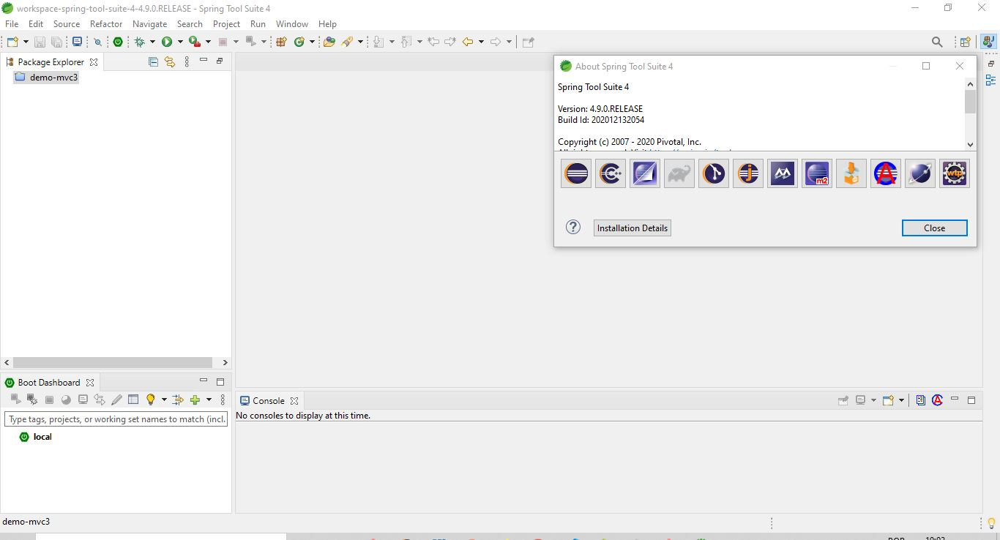
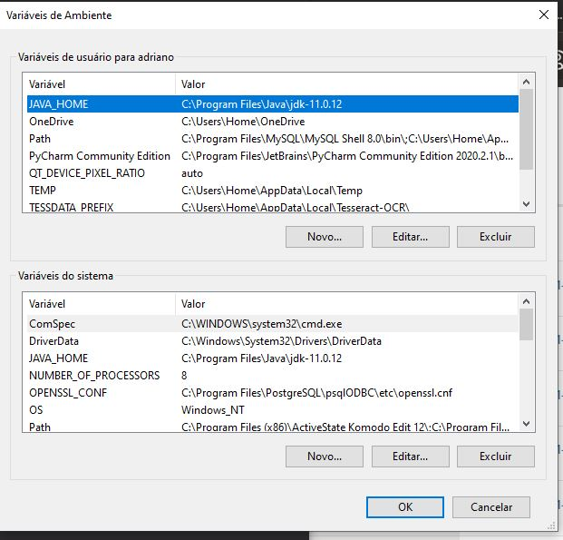
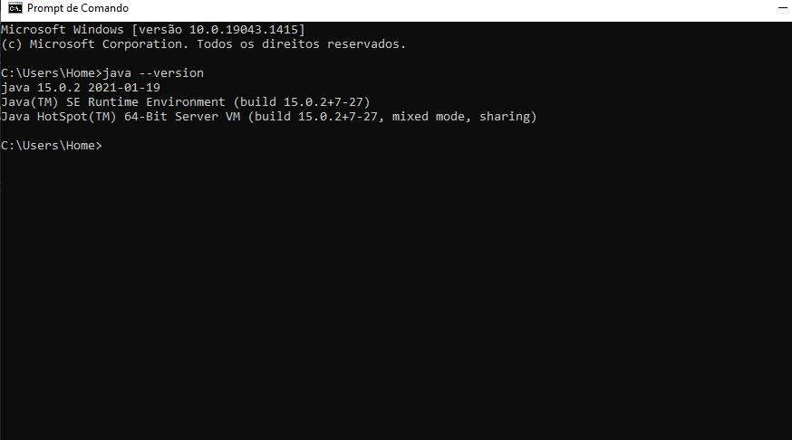
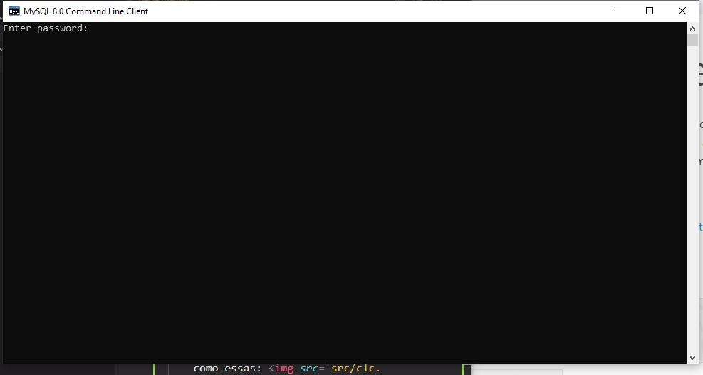
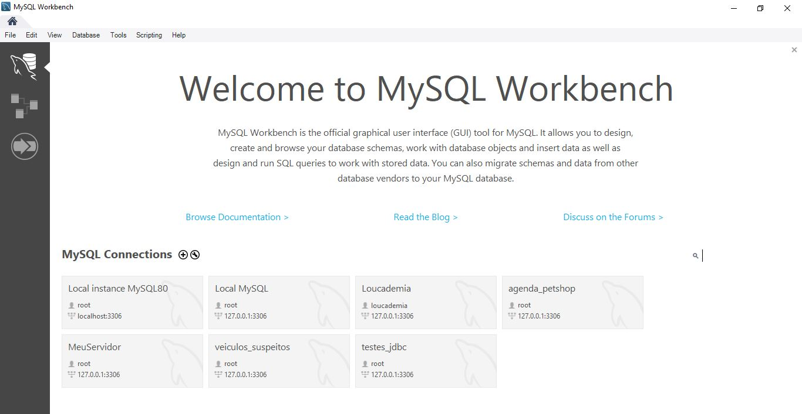
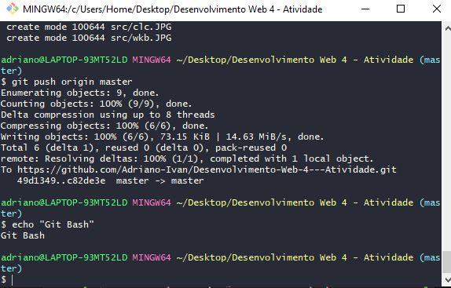
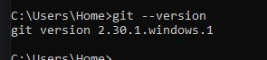

<h1>FERRAMENTAS DE DESENVOLVIMENTO INSTALADAS</H1>
<h2>Sistema Operacional no qual as ferramentas foram instaladas</h2>

Windows 10 Home

<h2>Spring Tool Suite</h2>
<h3>Definição</h3>

IDE (Integrated Development Environment) - Um ambiente de desenvolvimento integrado, usado para trabalhar com recursos da tecnologia Java e do framework Spring Boot com mais eficiência e produtividade.

<h3>Versão instalada</h3>

4.9.0

<h3>Instalação</h3>

A IDE é uma versão melhorada do Eclipse, portanto pode ser obtida pelos próprios recursos do Eclipse, mas pode também pode ser instalada individualmente, dessa forma:

<ul>
    <li>Indo para o site oficial: <a href='https://spring.io/tools' target='_blank'>Site oficial do Spring</a></li>
    <li>Fazendo o download do instalador.</li>
    <li>Executando o instalador.</li>
    <li>Seguindo o Wizard de instalação.</li>
    <li>Verificando se foi instalado com sucesso.</li>
    <li>A aparência da IDE será próxima disso: 
     
    </li>

</ul>
<h2>Java</h2>
<h3>Definição</h3>

Java é uma linguagem de programação que segue o paradigma orientado a objetos, e atualmente é uma das mais utilizadas no Desenvolvimento Web da parte Back-End, concorrendo, por exemplo, com o framework Node.js e com Python. Fala-se que Spring Boot é um framework do Java, uma vez que traz soluções em alto nível construídas com essa linguagem.

<h3>Versão instalada</h3>

Duas versões: 11 e 15

<h3>Instalação</h3>

Instalar o Java significa instalar o JDK (Java Development Kit), que engloba a JRE e a JVM. A JRE poderá ser configurada na IDE, para a execução das aplicações Java. Instala-se o JDK da seguinte forma:

<ul>
    <li>Indo para o site da Oracle, na parte de downloads, e baixando o instalador:  <a href='https://www.oracle.com/java/technologies/downloads/'target='_blank'>Site oficial para instalação do JDK</a>.</li>
    <li>Seguindo os passos de instalação do Wizard.</li>
    <li>Configurando o JDK instalado como variável de ambiente: 
     
    </li>
    <li>Configurando a JRE na IDE e testando um projeto.</li>
    <li>Verificando a versão pela linha de comando:
    </li>
</ul>

<h2>MySQL</h2>
<h3>Definição</h3>

O MySQL é um SGBD (Sistema Gerenciador de Banco de Dados), tecnologia usada para o armazenamento de dados da aplicação e tratamentos variantes, como buscas, atualizações e exclusões. Usa a linguagem SQL para tais operações e pode ser utilizado pela linha de comando ou por meio do MySQL Workbench, uma ferramenta gráfica com vários recursos.

<h3>Versão instalada</h3>

8.0.23

<h3>Instalação</h3>
<ul>
    <li>Baixar o instalador  <a href='https://dev.mysql.com/downloads/installer/'target='_blank'>Site oficial para instalação do MySQL</a>.</li>
    <li>Seguir os passos de instalação do Wizard, definindo dados como senha e usuário.</li>
    <li>Poderá ser verificado no Command Line Client e no MySQL Workbench, cujas interfaces serão como essas:  
    </li>
    
</ul>

<h2>Git</h2>
<h3>Definição</h3>

Git é uma ferramenta de versionamento, ou seja, ao iniciá-lo em um projeto, é possível fazer coisas como criar diferentes ramificações de versões do projeto (possibilitando que vários membros de uma equipe possam trabalhar em partes diferentes e que depois possam juntá-las),criar históricos de mudança (possibilitando que cada membro saiba quem fez alguma coisa específica) e retornar a estágios anteriores do desenvolvimento (possiblitando a verificação de erros, por exemplo).

A tecnologia Git possibilita tudo isso, porém é apenas uma tecnologia local. Suas versões remotas, como o GitHub, expandem a capacidade do Git para a colaboração entre pessoas de todo mundo, caso tenham internet e conta em um site como esse. 

<h3>Versão instalada</h3>

2.30.1

<h3>Instalação</h3>
<ul>
    <li>Baixar o instalador  <a href='https://git-scm.com/downloads'target='_blank'>Site oficial para instalação do Git</a>.</li>
    <li>Executar o instaldor e seguir os passos de instalação do Wizard.</li>
    <li>Será instalado um Git Bash. Os comandos poderão ser executado normalmente, mas o Git Bash possibilita a execução de comandos como os das distribuições Linux:  
    </li>
    
</ul>
