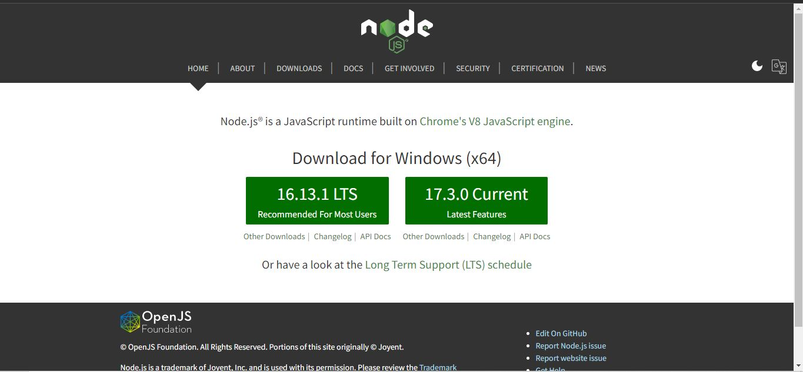
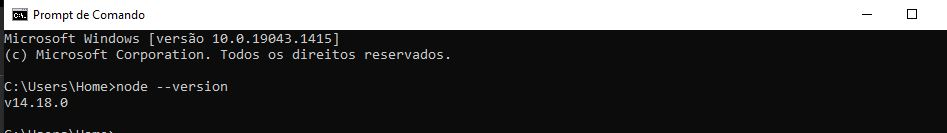
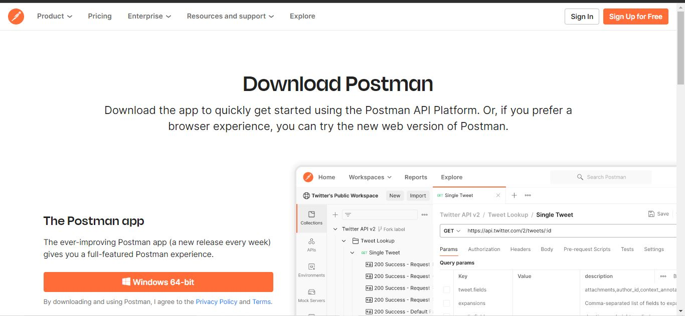
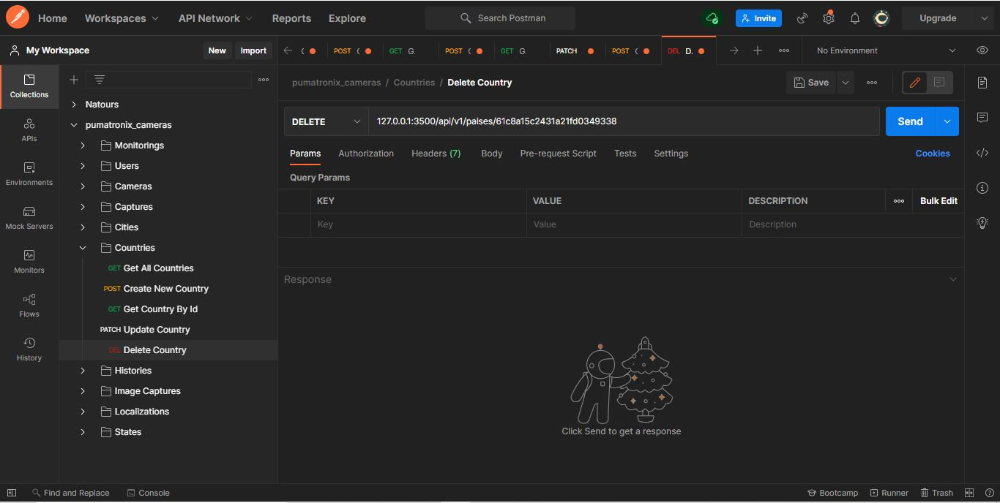
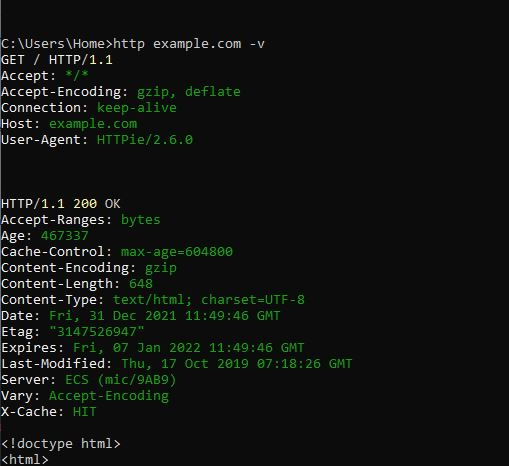
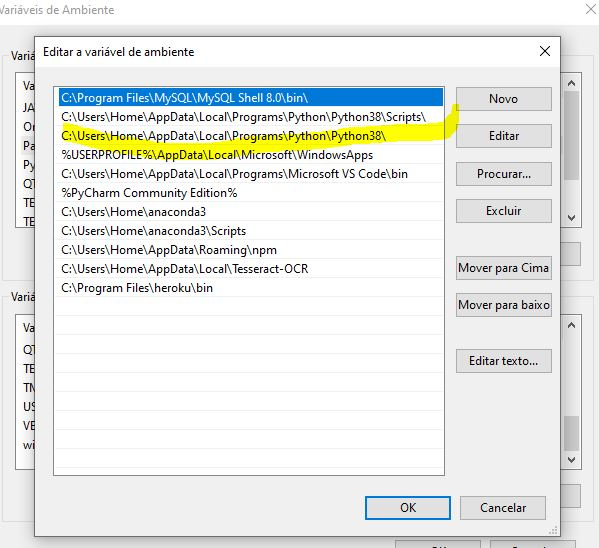

<h1>FERRAMENTAS DE DESENVOLVIMENTO INSTALADAS</H1>
<h2>Sistema Operacional no qual as ferramentas foram instaladas</h2>

Windows 10 Home

<h2>Spring Tool Suite</h2>
<h3>Definição</h3>

IDE (Integrated Development Environment) - Um ambiente de desenvolvimento integrado, usado para trabalhar com recursos da tecnologia Java e do framework Spring Boot com mais eficiência e produtividade.

<h3>Versão instalada</h3>

4.9.0

<h3>Instalação</h3>

A IDE é uma versão melhorada do Eclipse, portanto pode ser obtida pelos próprios recursos do Eclipse, mas pode também pode ser instalada individualmente, dessa forma:

<ul>
    <li>Indo para o site oficial: <a href='https://spring.io/tools' target='_blank'>Site oficial do Spring</a></li>
    <li>Fazendo o download do instalador.</li>
    <li>Executando o instalador.</li>
    <li>Seguindo o Wizard de instalação.</li>
    <li>Verificando se foi instalado com sucesso.</li>
    <li>A aparência da IDE será próxima disso: 
     
    </li>

</ul>
<h2>Java</h2>
<h3>Definição</h3>

Java é uma linguagem de programação que segue o paradigma orientado a objetos, e atualmente é uma das mais utilizadas no Desenvolvimento Web da parte Back-End, concorrendo, por exemplo, com o framework Node.js e com Python. Fala-se que Spring Boot é um framework do Java, uma vez que traz soluções em alto nível construídas com essa linguagem.

<h3>Versão instalada</h3>

Duas versões: 11 e 15

<h3>Instalação</h3>

Instalar o Java significa instalar o JDK (Java Development Kit), que engloba a JRE e a JVM. A JRE poderá ser configurada na IDE, para a execução das aplicações Java. Instala-se o JDK da seguinte forma:

<ul>
    <li>Indo para o site da Oracle, na parte de downloads, e baixando o instalador:  <a href='https://www.oracle.com/java/technologies/downloads/'target='_blank'>Site oficial para instalação do JDK</a>.</li>
    <li>Seguindo os passos de instalação do Wizard.</li>
    <li>Configurando o JDK instalado como variável de ambiente: 
     
    </li>
    <li>Configurando a JRE na IDE e testando um projeto.</li>
    <li>Verificando a versão pela linha de comando:
    </li>
</ul>

<h2>MySQL</h2>
<h3>Definição</h3>

O MySQL é um SGBD (Sistema Gerenciador de Banco de Dados), tecnologia usada para o armazenamento de dados da aplicação e tratamentos variantes, como buscas, atualizações e exclusões. Usa a linguagem SQL para tais operações e pode ser utilizado pela linha de comando ou por meio do MySQL Workbench, uma ferramenta gráfica com vários recursos.

<h3>Versão instalada</h3>

8.0.23

<h3>Instalação</h3>
<ul>
    <li>Baixar o instalador  <a href='https://dev.mysql.com/downloads/installer/'target='_blank'>Site oficial para instalação do MySQL</a>.</li>
    <li>Seguir os passos de instalação do Wizard, definindo dados como senha e usuário.</li>
    <li>Poderá ser verificado no Command Line Client e no MySQL Workbench, cujas interfaces serão como essas:  
    </li>
    
</ul>

<h2>Git</h2>
<h3>Definição</h3>

Git é uma ferramenta de versionamento, ou seja, ao iniciá-lo em um projeto, é possível fazer coisas como criar diferentes ramificações de versões do projeto (possibilitando que vários membros de uma equipe possam trabalhar em partes diferentes e que depois possam juntá-las),criar históricos de mudança (possibilitando que cada membro saiba quem fez alguma coisa específica) e retornar a estágios anteriores do desenvolvimento (possiblitando a verificação de erros, por exemplo).

A tecnologia Git possibilita tudo isso, porém é apenas uma tecnologia local. Suas versões remotas, como o GitHub, expandem a capacidade do Git para a colaboração entre pessoas de todo mundo, caso tenham internet e conta em um site como esse. 

<h3>Versão instalada</h3>

2.30.1

<h3>Instalação</h3>
<ul>
    <li>Baixar o instalador  <a href='https://git-scm.com/downloads'target='_blank'>Site oficial para instalação do Git</a>.</li>
    <li>Executar o instaldor e seguir os passos de instalação do Wizard.</li>
    <li>Será instalado um Git Bash. Os comandos poderão ser executado normalmente, mas o Git Bash possibilita a execução de comandos como os das distribuições Linux:  
    </li>
    
</ul>

<h2>Node.js</h2>
<h3>Definição</h3>

 Node.js é um framework do JavaScript que permite a execução de códigos dessa linguagem em ambientes fora do navegador, e é usado para a construção da parte server-side da aplicação, e atualmente é uma das tecnologias mais usadas no back-end, juntamente com o Java. Utilizando o framework Express, torna-se fácil a criação de servidores. Seu gerenciador de dependências, o NPM, possibilita a obtenção de plugins (como o Express) de forma rápida e prática, apenas utlizando a linha de comando a partir da raiz de um projeto.

<h3>Versão instalada</h3>

14.18.0

<h3>Instalação</h3>
<ul>
    <li>Baixar o instalador  <a href='https://nodejs.org/en/'target='_blank'>Site oficial para instalação do Node</a>.</li>
    <li>Executar o instalador e seguir os passos de instalação do Wizard.</li>
    <li>Será instalado um bash do Node, que permitirá a execução de código JavaScript em um ambiente fora do navegador. Mas isso não é o mais importante: para testar, basta criar uma pasta qualquer e digitar o comando 'npm init', e isso criará um projeto Node. Para saber se está funcionando, basta verificar se foi criado um arquivo 'package.json',que conterá informações do projeto. O comando 'node --version', na linha de comando, mostrará a versão do Node.  
    </li>
    
</ul>

<h2>Postman</h2>
<h3>Definição</h3>

Quando são criadas aplicações server-side, é possível que uma opção seja a criação de um Web Service ou API. Aplicações que 'oferecem um serviço' (Web Service), ou que servem como 'interfaces de programação de aplicação' (API), simplesmente funcionam como aplicações que executam os métodos HTTP correspondentes a um CRUD (os métodos DELETE (para exclusão de dados), PATCH(para atualização), GET (para recuperar todos os dados de uma entidade ou de um elemento específico) e POST (para inserção)), e que retornam dados em formato XML ou JSON. O fato de essas aplicações trabalharem apenas com os dados permite que elas sejam aproveitadas por várias aplicações: os dados e funcionalidades de uma API podem ser requisitados tanto por uma aplicação da Web, quanto por uma aplicação Mobile, e isso elimina a necessidade de criar um serviço para cada aplicação. Se houver necessidade de serviço para 10 aplicações, o uso de uma API elimina a necessidade de criar 9 outros serviços.

Esse método de criar aplicações é uma arquitetura denominada REST (Representational State Transfer).

E como testar essas aplicações ? Se trabalham apenas com os dados, como verificar sua eficiência durante o desenvolvimento ? Para isso, existem clientes HTTP como o Postman. O Postman é um cliente (pois é ele quem faz as requisições e recebe o serviço) HTTP que oferece a funcionalidade de fazer testes de requisição, verificando as respostas recebidas, para analisar se elas são as esperadas. Basta associar cada URL com o seu método HTTP correspondente e enviar a requisição, verificando a resposta depois. Por permitir a criação de várias pastas e requisições separadas e organizadas, também se torna uma ferramenta de documentação de APIs, e não só de testes.

<h3>Versão instalada</h3>

9.7.1

<h3>Instalação</h3>
<ul>
    <li>Baixar o instalador e executar. Também é possível utilizar a versão da Web da aplicação. É provável que seja solicitado um registro em ambos os casos. <a href='https://www.postman.com/downloads/'target='_blank'>Site oficial para instalação do Postman</a>.</li>
    <li>O Postman é bem intuitivo, bastando explorar a interface da aplicação para saber como ela funciona. Os trabalhos de testes e documentação são feitos em 'My Workspace'. A aplicação vem com a interface branca por padrão, mas o modo noturno pode ser configurado. 
    </li>
    
</ul>

<h2>Httpie</h2>
<h3>Definição</h3>

Com o Httpie, é possível testar requisições por linha de comando

<h3>Versão instalada</h3>

2.6.0

<h3>Instalação</h3>
<ul>
    <li>Ter o Python instalado.</li>
    <li>Ter a pasta Scripts da instalação do Python como variável de ambiente, para utilização do gerenciador pip.</li>
    <li>Utilizar o comando 'pip install -U httpie'.</li>
    <li>Fechar a linha de comando e abrir novamente.<li>
    <li>Testar uma requisição. 
      </li>
   
   
    
</ul>
